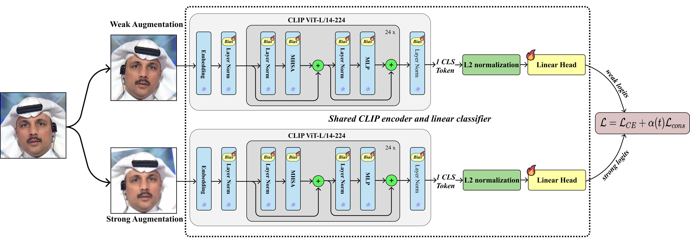
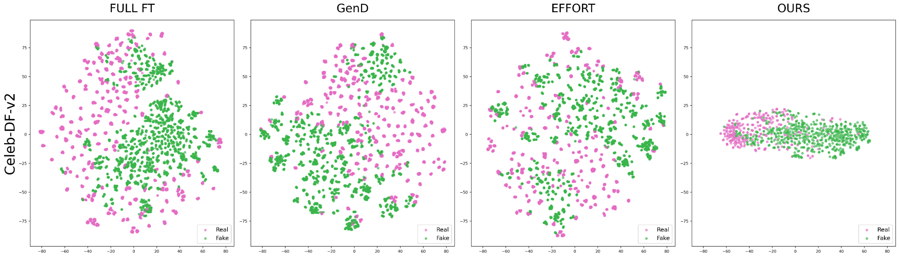

# BiasConsist: Consistency-Guided Bias Tuning for Deepfake Detection

<p align="center">
  
</p>

<p align="center">
  <a href="https://pytorch.org/"></a>
  <a href="https://github.com/openai/CLIP"></a>
  <a href="#trainable-parameters"></a>
  <a href="#in-domain-evaluation-faceforensics-c23"></a>
  <a href="#cross-method-generalization-df40-benchmark"></a>
  <a href="LICENSE"></a>
</p>

---

## 📌 Table of Contents
- [Overview](#-overview)
- [Key Highlights & Contributions](#-key-highlights--contributions)
- [Methodology & Architecture](#-methodology--architecture)
  - [1. Visual Backbone & Feature Extractor](#1-visual-backbone--feature-extractor)
  - [2. Bias-Only Parameter-Efficient Tuning (BitFit)](#2-bias-only-parameter-efficient-tuning-bitfit)
  - [3. Weak-to-Strong Augmentations](#3-weak-to-strong-augmentations)
  - [4. Consistency Regularization & Optimization Objective](#4-consistency-regularization--optimization-objective)
- [Feature Space Analysis (t-SNE)](#-feature-space-analysis-t-sne)
- [Benchmark Results](#-benchmark-results)
  - [In-Domain Evaluation (FaceForensics++ C23)](#in-domain-evaluation-faceforensics-c23)
  - [Cross-Dataset Generalization](#cross-dataset-generalization)
  - [Cross-Method Generalization (DF40 Benchmark)](#cross-method-generalization-df40-benchmark)
  - [Ablation Studies](#ablation-studies)
- [Repository Structure & Detector Variants](#-repository-structure--detector-variants)
- [Installation & Setup](#-installation--setup)
- [Data Preparation](#-data-preparation)
- [Training](#-training)
- [Evaluation & Feature Analysis](#-evaluation--feature-analysis)
- [Citation & Acknowledgments](#-citation--acknowledgments)

---

## 📖 Overview

Deepfake creation techniques based on advanced GANs and Diffusion Models generate photorealistic facial manipulations that easily deceive human vision and conventional detection algorithms. Traditional detectors heavily rely on low-level frequency artifacts or standard convolutional neural networks (CNNs), which suffer from poor generalization when applied to unseen manipulation algorithms, novel datasets, or media compressed through social media pipelines.

While Vision Foundation Models such as **CLIP (ViT-L/14)** offer rich, highly transferable representations learned from broad internet-scale vision-language pretraining, **fully fine-tuning** these models typically results in:
1. **Severe Catastrophic Forgetting**: Pretrained general knowledge is degraded.
2. **Overfitting to Generator-Specific Artifacts**: The detector becomes brittle to out-of-distribution alterations.
3. **Prohibitive Computational Overhead**: Optimizing over 300 million parameters is resource-intensive.

**BiasConsist** resolves this dilemma through a simple, elegant, and highly effective parameter-efficient fine-tuning (PEFT) framework:
- **Bias-Only Backbone Adaptation**: It freezes all attention and feed-forward weight matrices ($W$), optimizing **only** the additive bias vectors ($\theta_b$) and a lightweight linear classification head—amounting to only **0.27M trainable parameters (~0.09% of CLIP ViT-L/14)**.
- **Weak-to-Strong Consistency Regularization**: An uncorrupted, weakly augmented view acts as a detached teacher to guide the model's prediction on a strongly perturbed student view via temperature-scaled KL-divergence. This explicitly prevents the model from relying on fragile low-level cues destroyed by compression and visual noise, driving the network toward invariant forensic representations.

---

## ✨ Key Highlights & Contributions

| Feature | Full Fine-Tuning | Traditional Adapters (LoRA / Effort) | **BiasConsist (Ours)** |
| :--- | :---: | :---: | :---: |
| **Trainable Backbone Weights** | 100% (~304M) | 0.1% - 2% (0.19M - 5.7M) | **0.0% (Frozen)** |
| **Trainable Parameters** | ~304M | 0.19M - 5.7M | **0.27M (~0.09%)** |
| **FF++ In-Domain AUC** | 98.2% | 93.9% - 98.9% | **99.1% (SOTA)** |
| **DF40 Cross-Method AUC** | 82.1% | 93.8% - 95.7% | **96.8% (SOTA on all 7 methods)** |
| **Inference Overhead** | 1× | 1× - 1.2× | **1× (Standard single view, zero overhead)** |

- ⚡ **Ultra Parameter-Efficient**: Updates only **0.27M parameters**, reducing training memory footprint and eliminating risk of weight corruption.
- 🎯 **State-of-the-Art In-Domain**: Reaches **99.1% mean video-level AUC** on FaceForensics++ C23, outperforming SOTA PEFT detectors including GenD (98.9%), ForAda (96.8%), and Effort (93.9%).
- 🌐 **Robust Cross-Dataset Generalization**: Achieves **92.9% average AUC** across five challenging unseen datasets (*Celeb-DF-v2, DFD, DFDC, DFDCP, UADFV*) without target-domain calibration.
- 🛡️ **Unmatched Cross-Method Robustness**: Sets a new benchmark on the DF40 protocol with **96.8% average AUC**, achieving the **highest performance across all 7 unseen manipulation techniques** (*UniFace, BlendFace, E4S, FaceDancer, FSGAN, InSwap, SimSwap*).
- ⏱️ **Zero Test-Time Overhead**: Consistency regularization is active strictly during training. Inference takes a single image/frame through the adapted CLIP backbone without any multi-view latency.

---

## 🔬 Methodology & Architecture

The overall pipeline of **BiasConsist** is illustrated below:

<p align="center">
  
  <br>
  <em>Figure 1: Architectural overview of BiasConsist with bias-only CLIP adaptation and weak-to-strong consistency regularization.</em>
</p>

### 1. Visual Backbone & Feature Extractor
- Given an input face crop $x \in \mathbb{R}^{H \times W \times 3}$, BiasConsist utilizes the **CLIP ViT-L/14** visual encoder consisting of 24 Transformer layers, hidden dimension $D = 1024$, intermediate MLP dimension $4096$, and 16 attention heads.
- The output representation $z = f(x) \in \mathbb{R}^{1024}$ is extracted from the post-LayerNorm `[CLS]` token.
- **$L_2$ Feature Normalization**: The token feature is $L_2$-normalized prior to classification:
  $$\hat{z} = \frac{z}{\|z\|_2 + \epsilon}$$
  where $\epsilon = 10^{-6}$. Normalizing embedding features enforces angular margin separation between real and forged faces.
- The normalized vector $\hat{z}$ is projected to binary classification logits $\hat{y} \in \mathbb{R}^2$ via a linear classification head:
  $$\hat{y} = W_{\text{head}} \hat{z} + b_{\text{head}}$$

### 2. Bias-Only Parameter-Efficient Tuning (BitFit)
To retain the vast zero-shot knowledge of CLIP and curb overfitting, all backbone weight tensors $\Theta_w$ (Multi-Head Self-Attention weights, MLP projection matrices, patch embeddings, and LayerNorm weight parameters) are strictly **frozen**.

Only additive bias parameters $\Theta_b$ and the linear classification head are updated:
$$\Theta_w \leftarrow \text{Frozen}, \quad \Theta_b \leftarrow \Theta_b - \eta \nabla_{\Theta_b} \mathcal{L}$$

- **Trainable parameters breakdown**:
  - CLIP ViT-L/14 backbone biases: **272,384**
  - Linear classification head ($1024 \times 2 + 2$): **2,050**
  - **Total Trainable Parameters**: **274,434 (~0.27M)**

### 3. Weak-to-Strong Augmentations
Each input face image $x$ undergoes two separate stochastic augmentation pathways:
- **Weak Augmentation Branch ($A_w$)**: Applies only random horizontal flipping ($p = 0.5$). This retains subtle manipulation artifacts and fine-grained facial cues.
- **Strong Augmentation Branch ($A_s$)**: Applies a composition of severe visual perturbations designed to simulate social media transmission and compression:
  - Horizontal flipping ($p = 0.5$)
  - Random rotation within $[-10^\circ, +10^\circ]$ ($p = 0.5$)
  - Gaussian blur with kernel size $k \in [3, 7]$ ($p = 0.5$)
  - Color jitter (brightness & contrast perturbation $\pm 10\%$) ($p = 0.5$)
  - JPEG compression simulation with quality factor $Q \in [40, 100]$ ($p = 0.5$)

### 4. Consistency Regularization & Optimization Objective
Both views are propagated through the shared model to produce weak logits $z_w$ and strong logits $z_s$:
- **Supervised Cross-Entropy**: Both views are guided by ground-truth labels using cross-entropy with label smoothing ($\epsilon = 0.1$):
  $$\mathcal{L}_{CE} = \frac{1}{2} \left[ \mathcal{L}_{CE}(p_w, y) + \mathcal{L}_{CE}(p_s, y) \right]$$
- **Weak-to-Strong Knowledge Consistency**: The weak prediction acts as a pseudo-teacher for the strongly perturbed student view. The teacher distribution is computed with temperature scaling $\tau = 1.0$ and **detached** from the computational graph:
  $$p_w = \text{softmax}\left(\frac{z_w}{\tau}\right). \text{detach}(), \quad p_s = \text{softmax}\left(\frac{z_s}{\tau}\right)$$
  The consistency loss is formulated as the Kullback-Leibler (KL) divergence:
  $$\mathcal{L}_{cons} = \mathcal{D}_{KL}(p_w \parallel p_s) = \sum_{c=1}^2 p_w^{(c)} \log \left( \frac{p_w^{(c)}}{p_s^{(c)}} \right) \cdot \tau^2$$
- **Dynamic Warmup Schedule**: To prevent erratic gradients in the early training phases before the weak view becomes reliable, the consistency coefficient $\alpha(t)$ linearly ramps up:
  $$\alpha(t) = \alpha_{\max} \cdot \min\left(1, \frac{t}{T_{\text{warmup}}}\right)$$
  where $\alpha_{\max} = 0.5$ and $T_{\text{warmup}} = 3$ epochs.
- **Overall Objective**:
  $$\mathcal{L} = \mathcal{L}_{CE} + \alpha(t) \mathcal{L}_{cons}$$

---

## 🎨 Feature Space Analysis (t-SNE)

To understand why BiasConsist exhibits superior out-of-distribution generalization, we visualize the feature distributions learned by different adaptation methods on the unseen **Celeb-DF-v2** benchmark:

<p align="center">
  
  <br>
  <em>Figure 2: 2D t-SNE projections of real (pink) and fake (green) samples from Celeb-DF-v2 in the feature spaces learned by Full Fine-Tuning (Full FT), GenD, Effort, and BiasConsist (Ours).</em>
</p>

- **Full Fine-Tuning (Full FT)**: Features are scattered across the latent space, with significant entanglement and overlapping between real and fake samples, confirming catastrophic overfitting to training-domain artifacts.
- **GenD & Effort**: Feature distributions display noticeable mixing between real and manipulated faces under cross-dataset domain shifts.
- **BiasConsist (Ours)**: Displays a distinctly compact and well-structured representation, with real and fake samples exhibiting strong semantic clustering and clear separation tendency, leading to superior generalization.

---

## 📊 Benchmark Results

All models are trained exclusively on **FaceForensics++ (FF++) C23** and tested across multiple out-of-domain benchmarks. Evaluation follows the standard video-level AUC (%) metric with 32 sampled frames per video.

### In-Domain Evaluation (FaceForensics++ C23)
Evaluated across all four manipulation sub-datasets: DeepFakes (DF), Face2Face (F2F), FaceSwap (FS), and NeuralTextures (NT).

| Method | Trainable Params | DF (%) | F2F (%) | FS (%) | NT (%) | Mean AUC (%) |
| :--- | :---: | :---: | :---: | :---: | :---: | :---: |
| **ForAda** | 5.7M | 99.7 | 97.0 | 98.6 | 91.9 | 96.8 |
| **Effort** | 0.19M | 99.4 | 93.2 | 98.4 | 84.6 | 93.9 |
| **GenD (PE)** | 0.10M | 99.7 | 99.3 | **99.1** | 97.5 | 98.9 |
| **BiasConsist (Ours)** | **0.27M** | **99.9** | **99.7** | 98.7 | **98.2** | **99.1** |

> **Takeaway**: BiasConsist achieves the top score on 3 out of 4 subsets and sets the new state-of-the-art mean in-domain AUC of **99.1%**, proving that updating only backbone biases fully preserves discriminative power.

---

### Cross-Dataset Generalization
Direct zero-shot evaluation on five unseen benchmark datasets without target-domain retraining or fine-tuning.

| Method | Trainable Params | CDF-v2 | DFD | DFDC | DFDCP | UADFV | Average AUC |
| :--- | :---: | :---: | :---: | :---: | :---: | :---: | :---: |
| **F3Net** | 22M | 0.789 | 0.844 | 0.718 | 0.749 | 0.934 | 0.807 |
| **SPSL** | 21M | 0.799 | 0.871 | 0.724 | 0.770 | 0.942 | 0.821 |
| **SRM** | 55M | 0.840 | 0.885 | 0.695 | 0.728 | 0.942 | 0.818 |
| **CORE** | 22M | 0.809 | 0.882 | 0.721 | 0.720 | 0.941 | 0.815 |
| **RECCE** | 48M | 0.823 | 0.891 | 0.696 | 0.734 | 0.945 | 0.818 |
| **SLADD** | 21M | 0.837 | 0.904 | 0.772 | 0.756 | – | 0.817 |
| **SBI** | 18M | 0.886 | 0.827 | 0.717 | 0.848 | – | 0.820 |
| **UCF** | 47M | 0.837 | 0.867 | 0.742 | 0.770 | – | 0.804 |
| **IID** | 66M | 0.838 | 0.939 | 0.700 | 0.689 | – | 0.792 |
| **LSDA** | 133M | 0.875 | 0.881 | 0.701 | 0.812 | – | 0.817 |
| **ProDet** | 96M | 0.926 | 0.901 | 0.707 | 0.828 | – | 0.841 |
| **CDFA** | 87M | 0.938 | 0.954 | 0.830 | 0.881 | – | 0.901 |
| **Effort** | 0.19M | 0.956 | 0.965 | 0.843 | 0.909 | 0.974 | 0.929 |
| **ForAda** | 5.7M | 0.957 | 0.972 | **0.872** | **0.928** | **0.994** | **0.945** |
| **GenD** | 0.10M | 0.960 | 0.970 | 0.870 | 0.917 | 0.992 | 0.942 |
| **BiasConsist (Ours)** | **0.27M** | **0.966** | **0.979** | 0.847 | 0.868 | 0.985 | **0.929** |

---

### Cross-Method Generalization (DF40 Benchmark)
Evaluated on seven unseen facial manipulation algorithms from DF40 to test resilience against novel generative algorithms.

| Method | Params | UniFace | BlendFace | E4S | FaceDancer | FSGAN | InSwap | SimSwap | Average AUC |
| :--- | :---: | :---: | :---: | :---: | :---: | :---: | :---: | :---: | :---: |
| **F3Net** | 22M | 0.809 | 0.808 | 0.494 | 0.717 | 0.845 | 0.757 | 0.674 | 0.729 |
| **SPSL** | 21M | 0.747 | 0.748 | 0.514 | 0.666 | 0.812 | 0.643 | 0.665 | 0.685 |
| **SRM** | 55M | 0.749 | 0.704 | 0.704 | 0.659 | 0.772 | 0.793 | 0.694 | 0.725 |
| **CORE** | 22M | 0.871 | 0.843 | 0.679 | 0.774 | 0.958 | 0.855 | 0.724 | 0.815 |
| **RECCE** | 48M | 0.898 | 0.832 | 0.683 | 0.848 | 0.949 | 0.848 | 0.768 | 0.832 |
| **SLADD** | 21M | 0.878 | 0.882 | 0.765 | 0.825 | 0.943 | 0.879 | 0.794 | 0.852 |
| **SBI** | 18M | 0.724 | 0.891 | 0.750 | 0.594 | 0.803 | 0.712 | 0.701 | 0.739 |
| **Effort** | 0.19M | 0.962 | 0.873 | 0.983 | 0.926 | 0.957 | 0.936 | 0.926 | 0.938 |
| **ForAda** | 5.7M | 0.950 | 0.880 | 0.968 | 0.945 | 0.975 | 0.948 | 0.912 | 0.940 |
| **GenD** | 0.10M | 0.964 | 0.912 | 0.988 | 0.954 | 0.974 | 0.965 | 0.944 | 0.957 |
| **BiasConsist (Ours)** | **0.27M** | **0.977** | **0.930** | **0.990** | **0.972** | **0.978** | **0.969** | **0.960** | **0.968** |

> 🏆 **Key Result**: BiasConsist ranks **#1 across all 7 unseen manipulation techniques**, achieving **96.8% average AUC**, proving that weak-to-strong consistency teaches the model manipulation-invariant features rather than method-specific artifacts.

---

### Ablation Studies

#### 1. PEFT Strategies and $L_2$ Normalization
Video-level AUC reported across 5 random training seeds ($\text{Mean} \pm \text{Std}$):

| Adaptation Strategy | Classifier Head | $L_2$ Norm | Loss | Cross-Dataset Average AUC |
| :--- | :---: | :---: | :---: | :---: |
| **Full Fine-Tuning** | Linear | No | CE | 0.589 ± 0.033 |
| **LoRA** | Linear | No | CE | 0.921 ± 0.007 |
| **LoRA** | Linear | Yes | CE | 0.899 ± 0.009 |
| **LayerNorm Tuning** | Linear | No | CE | 0.916 ± 0.009 |
| **LayerNorm Tuning** | Linear | Yes | CE | 0.923 ± 0.009 |
| **Bias-Only (BitFit)** | Linear | No | CE | 0.915 ± 0.016 |
| **Bias-Only (BitFit)** | Linear | Yes | CE | 0.932 ± 0.017 |
| **BiasConsist (Ours)** | Linear | Yes | CE + KL | **0.929 ± 0.009** |

#### 2. Effect of Consistency Regularization on Unseen Manipulation Methods
Comparison of pure Bias-Only tuning vs. Consistency-guided BiasConsist across all 7 unseen methods:

| Method | UniFace | BlendFace | E4S | FaceDan | FSGAN | InSwap | SimSwap | Average AUC |
| :--- | :---: | :---: | :---: | :---: | :---: | :---: | :---: | :---: |
| **Bias-Only** | 0.967±0.011 | 0.916±0.015 | 0.984±0.011 | 0.956±0.011 | 0.976±0.008 | 0.952±0.015 | 0.947±0.014 | 0.957±0.011 |
| **BiasConsist** | **0.977±0.005** | **0.930±0.009** | **0.990±0.003** | **0.972±0.008** | **0.978±0.007** | **0.969±0.009** | **0.960±0.008** | **0.968±0.006** |
| *Improvement* | *+1.0%* | *+1.4%* | *+0.6%* | *+1.6%* | *+0.2%* | *+1.7%* | *+1.3%* | **+1.1%** |

---

## 📂 Repository Structure & Detector Variants

```text
BiasConsist/
├── datasets/                        # Dataset frame directories (RGB)
├── docs/                            # Documentation and paper illustrations
│   └── images/
│       ├── figure1_framework.png    # BiasConsist framework diagram
│       └── figure2_tsne.png         # t-SNE latent feature representations
├── preprocessing/                   # Data preprocessing & JSON metadata
│   └── dataset_json/                # DeepfakeBench JSON dataset splits
├── training/
│   ├── config/                      # YAML configuration files
│   │   ├── train_config.yaml        # Global training parameters
│   │   ├── test_config.yaml         # Global testing parameters
│   │   └── detector/                # Model-specific configurations
│   │       ├── BiasConsistency.yaml                 # ⭐ Primary paper model
│   │       ├── BiasArtifactConsistency.yaml          # Artifact-preserving variant
│   │       ├── BiasEMATeacherConsistency.yaml        # EMA teacher variant
│   │       ├── BiasLoraAsy.yaml                     # LoRA + Asymmetric contrastive
│   │       ├── BiasOnly.yaml                        # Pure BitFit baseline
│   │       └── siglip_bias_consistency.yaml         # SigLIP visual backbone
│   ├── dataset/                     # DeepfakeBench-style data loaders & augmentations
│   │   ├── abstract_dataset.py      # Dual-view weak/strong dataset pipeline
│   │   └── albu.py                  # Albumentations strong transforms
│   ├── detectors/                   # Detector model implementations
│   │   ├── BiasConsistency.py       # Primary BiasConsist detector
│   │   ├── BiasArtifactConsistency.py
│   │   ├── BiasEMATeacherConsistency.py
│   │   ├── BiasLoraAsy.py
│   │   ├── BiasOnly.py
│   │   └── SigLIPBiasConsistency.py
│   ├── metrics/                     # Evaluation metrics (Video AUC, EER, Acc)
│   ├── optimizor/                   # SAM and learning rate schedulers
│   ├── trainer/                     # Multi-GPU / Single-GPU trainer
│   ├── train.py                     # Main training script
│   └── test.py                      # Main evaluation & feature dump script
├── install.sh                       # Environment installation script
├── requirements.txt                 # Python dependencies list
├── train.sh                         # Quickstart training bash script
└── test.sh                          # Quickstart testing bash script
```

### Detector Implementations in Codebase
- **`BiasConsistency`** (`training/detectors/BiasConsistency.py`): The core framework proposed in the paper. Adapts only CLIP ViT-L/14 biases with weak-to-strong KL consistency.
- **`BiasArtifactConsistency`**: Implements confidence-gated KL divergence that selectively enforces consistency on high-confidence samples matching ground truth.
- **`BiasEMATeacherConsistency`**: Maintains a slow-moving Exponential Moving Average (EMA) teacher model to generate predictions for the weak view.
- **`BiasLoraAsy`**: Explores combining LoRA adapters on later transformer blocks with trainable backbone biases and asymmetric supervised contrastive loss.
- **`SigLIPBiasConsistency`**: Adapts the Google SigLIP backbone with bias consistency.

---

## ⚙️ Installation & Setup

### Requirements
- Linux or Windows
- Python ≥ 3.8
- CUDA ≥ 11.3
- PyTorch ≥ 1.12.0

### Step-by-Step Installation
1. Clone the repository:
```bash
git clone https://github.com/thanhquan123hi1/BiasConsist.git
cd BiasConsist
```

2. Create and activate a virtual environment (recommended):
```bash
conda create -n biasconsist python=3.9 -y
conda activate biasconsist
```

3. Install dependencies using `requirements.txt`:
```bash
pip install -r requirements.txt
```
*(Or execute the automated script: `bash install.sh`)*

---

## 🗂️ Data Preparation

We follow the standard [DeepfakeBench](https://github.com/SCLBD/DeepfakeBench) preprocessing protocol:
1. **Frame Extraction**: Sample 32 frames evenly from each video.
2. **Face Detection & Alignment**: Detect facial landmarks and align using RetinaFace.
3. **Bounding Box Expansion**: Enlarge the face bounding box by a factor of **1.3×**.
4. **Cropping & Resizing**: Crop aligned face and resize to $224 \times 224$ pixels in lossless PNG format.

### Expected Directory Layout
```text
datasets/
└── rgb/
    ├── FaceForensics++/
    │   ├── original_sequences/youtube/c23/frames/
    │   ├── manipulated_sequences/Deepfakes/c23/frames/
    │   ├── manipulated_sequences/Face2Face/c23/frames/
    │   ├── manipulated_sequences/FaceSwap/c23/frames/
    │   └── manipulated_sequences/NeuralTextures/c23/frames/
    ├── Celeb-DF-v2/
    ├── DeepFakeDetection/
    ├── DFDC/
    └── DFDCP/
```

Update your paths in `training/config/train_config.yaml` and `training/config/test_config.yaml`:
```yaml
rgb_dir: datasets/rgb
dataset_json_folder: preprocessing/dataset_json
log_dir: logs/
```

---

## 🚀 Training

To train **BiasConsist** on FaceForensics++ (C23) with evaluation on cross-dataset benchmarks:

```bash
python training/train.py \
  --detector_path training/config/detector/BiasConsistency.yaml \
  --train_dataset "FaceForensics++" \
  --test_dataset "Celeb-DF-v2" "DeepFakeDetection" "DFDC" "DFDCP" "UADFV"
```

### Key Training Hyperparameters (from `BiasConsistency.yaml`)
- **Backbone**: `openai/clip-vit-large-patch14`
- **Trainable Parameters**: `272,384` (biases) + `2,050` (linear head) = `274,434`
- **Batch Size**: 64 (train), 128 (test)
- **Optimizer**: Adam ($\text{lr} = 10^{-4}$, $\text{weight\_decay} = 10^{-4}$)
- **LR Schedule**: Cosine Annealing ($T_{\max} = 10$, $\eta_{\min} = 10^{-6}$)
- **Consistency**: Temperature $\tau = 1.0$, $\alpha_{\max} = 0.5$ with 3-epoch warmup
- **Label Smoothing**: 0.1
- **Epochs**: 10

### Fine-Tuning / Resuming from Checkpoint
```bash
python training/train.py \
  --detector_path training/config/detector/BiasConsistency.yaml \
  --weights_path path/to/checkpoint_best.pth
```

---

## 🧪 Evaluation & Feature Analysis

### Zero-Shot Testing on Unseen Datasets & Methods
Evaluate a trained checkpoint across unseen manipulation benchmarks:

```bash
python training/test.py \
  --detector_path training/config/detector/BiasConsistency.yaml \
  --test_dataset "Celeb-DF-v2" "DeepFakeDetection" "DFDC" "DFDCP" "UADFV" \
  --weights_path logs/bias_consistency/ckpt_best.pth
```

To evaluate on the **DF40** unseen manipulation methods:
```bash
python training/test.py \
  --detector_path training/config/detector/BiasConsistency.yaml \
  --test_dataset "uniface_ff" "blendface_ff" "e4s_ff" "facedancer_ff" "fsgan_ff" "inswap_ff" "simswap_ff" \
  --weights_path logs/bias_consistency/ckpt_best.pth
```

### Feature Extraction for t-SNE Visualizations
You can dump the 1024-dimensional normalized CLS feature embeddings using `--save_feat`:
```bash
python training/test.py \
  --detector_path training/config/detector/BiasConsistency.yaml \
  --test_dataset "Celeb-DF-v2" \
  --weights_path logs/bias_consistency/ckpt_best.pth \
  --save_feat \
  --feat_out_dir ./features/
```

---

## 📝 Citation & Acknowledgments

If you find **BiasConsist** useful for your research, please consider citing:

```bibtex
@article{dinh2024biasconsist,
  title={BiasConsist: Consistency-Guided Bias Tuning for Deepfake Detection},
  author={Dinh, Xuan-Huy and Phung-Le, Thanh-Quan and Nguyen, Duc-Thinh and Vu, Minh-Duc and Hoang, Van-Dung},
  journal={arXiv preprint},
  year={2024},
  institution={HCMC University of Technology and Engineering (HCMUTE)}
}
```

### Acknowledgments
This repository is built upon [DeepfakeBench](https://github.com/SCLBD/DeepfakeBench) and [OpenAI CLIP](https://github.com/openai/CLIP). We thank the authors for their open-source contributions.
